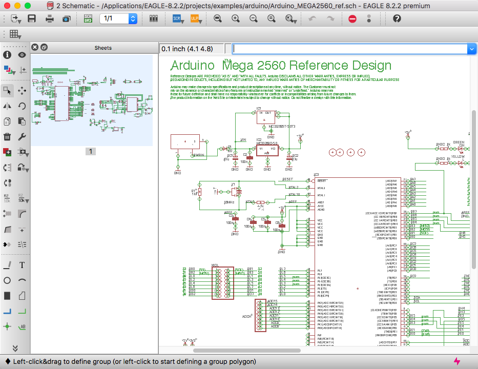

回路設計のためのソフトウェア
============================

-  書いた人: Kenichi Ito(nichiden\_27)
-  更新日時: 2017/08/02
-  実行に必要な知識・技能: 基本的な電子部品の知識
-  難易度: 3/練習・勉強が必要
-  情報の必須度: 2/知ってると楽

概要
----

電子回路の設計は手書きでもできますが、

-  回路図をチームで共有する
-  後から配線などを整理する
-  基板の配置を考える

といった場合は\ **専用ソフトウェアで回路図を描く**\ のが便利です。

回路設計ソフトは多数存在し、それぞれに特色があります。
本稿では、よく名前の挙がるものや最近注目されているものを独断で選んで解説します。

BSch3V
------

+----------+----------+----------+
| 開発     | 価格     | 拡張子   |
+==========+==========+==========+
| 水魚堂   | フリー   | .CE3     |
+----------+----------+----------+

-  `公式 <http://www.suigyodo.com/online/schsoft.htm>`__
-  `マニュアル <http://www.suigyodo.com/online/manual/>`__

Windows(7/8/10)専用の回路図エディタ(macOS向けには\ `Qt-BSch3V <#qt-bsch3v>`__\ が存在する)。

.. figure:: _media/bsch3v.png
   :alt: BSch3Vの画面

   BSch3Vの画面

構成は至ってシンプルだが、\ **軽快な動作と簡単な操作**\ に定評があり、小規模な回路であれば十分な機能を備えている。
**部品のライブラリをいくつでも導入できる**\ ため自由に拡張ができるのもポイントだ。

標準でも基本的な部品は用意されているが、マイコンなどのライブラリが多数のサイトで配布されているので、欲しい部品があればググってみよう。
また、部品エディタ「\ **LCoV**\ 」が同梱されているので、欲しい部品を自作したり(例:
`回路図エディタ
BSch3V用のmbed部品ライブラリ <https://developer.mbed.org/users/makimyan/notebook/回路図エディタ-bsch3v用のmbed部品ライブラリ>`__/
Ryo Aramaki氏)、BSch3V側から編集したりもできる。

開発元の水魚堂では、プリント基板編集ソフト「\ `Minimal Board
Editor <http://www.suigyodo.com/online/mbe/mbe.htm>`__\ 」も配布している。

操作/Tips
~~~~~~~~~

-  **ドラッグツール**\ は、範囲選択により回路の一部を移動できる。

   -  配線の片方だけを動かすと簡単に\ **斜めの線**\ が作れる。
   -  斜め線のアイコンは「エントリー」ツールで、配線の引き出しを表す。斜めの線として使わないこと。

-  **太い線と細い線のツール**\ があるが、太い線は複数の線をまとめた「パス線」。

   -  通常は細い方を使っていれば問題ない。

-  レイヤ機能が存在し、右のツールバーから操作できる。

   -  編集するレイヤを選択したり、可視/不可視の切り替えが可能。
   -  選択レイヤ以外に配置したものは\ **クリックしても反応しない**\ 。

      -  不具合ではないので、慌てないこと！

   -  多くの情報を書き込む場合に、コメント・ラベルを別レイヤにするなどの使い道が考えられる。

-  他のPCやモバイルからの閲覧用に、\ **PDFファイルを用意しておく**\ とよい。

   -  BSch3V自体にPDF書き出し機能はないが、印刷メニューからPDFに変換できる。

Qt-BSch3V Modified
------------------

+------------------+----------+----------+
| 開発             | 価格     | 拡張子   |
+==================+==========+==========+
| informationsea   | フリー   | .CE3     |
+------------------+----------+----------+

-  `公式 <https://informationsea.info/apps/qtbsch3v/>`__

QtというGUIフレームワークで\ `BSch3V <#bsch3v>`__\ をクロスプラットフォームに書き直したもの。

.. figure:: _media/qtbsch3v.png
   :alt: Qt-BSch3Vの画面

   Qt-BSch3Vの画面

水魚堂のコードをinformationsea氏が最近のmacOS向けにさらに改造したのが「Qt-BSch3V
Modified」である。
これのお陰で、MacユーザでもCE3ファイルを開くことができる。

BSch3V(及び同梱ソフト)の機能の多くが使用できるが、\ **日本語が表示できない**\ など問題もあるようだ。

Eagle
-----

+------------+------------------+--------------+
| 開発       | 価格             | 拡張子       |
+============+==================+==============+
| AutoDesk   | フリー(学生版)   | .sch, .brd   |
+------------+------------------+--------------+

-  `公式 <https://www.autodesk.com/products/eagle/overview>`__
-  `サポートトップ <https://knowledge.autodesk.com/ja/support/eagle?sort=score>`__

元々ドイツのCadSoft社が開発していたものを、\ `AutoDeskが2016年に買収した <http://makezine.jp/blog/2016/08/the-autodesk-family-grows-with-new-eagle-acquisition.html>`__\ 。
Windows / Mac / Linuxで使用可能。

   Eagleの画面

商用のプリント基板CADであり本来は数万円だが、基板サイズなどに制限付きの無料版が存在する。
さらに、AutoDeskの傘下に入ったことで\ **AutoDeskの学生プログラムの対象となった**\ 。

`教育機関限定版および学生版 <https://knowledge.autodesk.com/ja/search-result/caas/sfdcarticles/sfdcarticles/JPN/Eagle-Education.html>`__\ を使用することで、Premiumバージョン同等の機能を3年間使用できる(商用利用は不可)。
学生からすれば、\ **事実上の利用制限解除**\ である。

商用ソフトウェアなので機能は豊富であるが、そのぶん操作を覚えるのが大変でもある。

KiCad
-----

+------------+----------+---------------------+
| 開発       | 価格     | 拡張子              |
+============+==========+=====================+
| AutoDesk   | フリー   | .sch, .kicad\_pcb   |
+------------+----------+---------------------+

-  `公式 <http://kicad-pcb.org/>`__

**オープンソース**\ の回路CADソフト。
OSSなので当然全機能を無料で使用でき、商用利用に関する制限もない。
Eagle同様各種OSに対応している。

kicadについてツイートすると、国内コミュニティ\ `kicad\_jp <https://twitter.com/kicad_jp>`__\ の中の人がエゴサしてふぁぼってくれるらしい。
らしい

回路図やプリント基板の設計が可能で、非常に多機能。
チュートリアルをこなしてから使うのがいいだろう。

国内コミュニティの方々の努力により、現行バージョンでは\ **日本語版のマニュアルとチュートリアル**\ が同梱されるようになった。
メニューの ``ヘルプ`` から選択できる。
また、トラ技編集部から\ `Kicad本 <https://www.amazon.co.jp/dp/4789849279/>`__\ も出版されているので、紙のチュートリアルが欲しければ購入を検討してほしい。

まとめ
------

手軽さを取るならBSch3V、ある程度複雑な作業をするならKiCad、AutoDeskのファンならEagle……といったところだろうか。

最近はプリント基板を安価で製作してくれる業者が増え、\ **アマチュアの世界でもプリント基板の使用が拡大**\ しつつある。
プリント基板を使った製作を視野に入れるのであれば、KiCadやEagleを使えるようになることは決して損ではなさそうだ。
