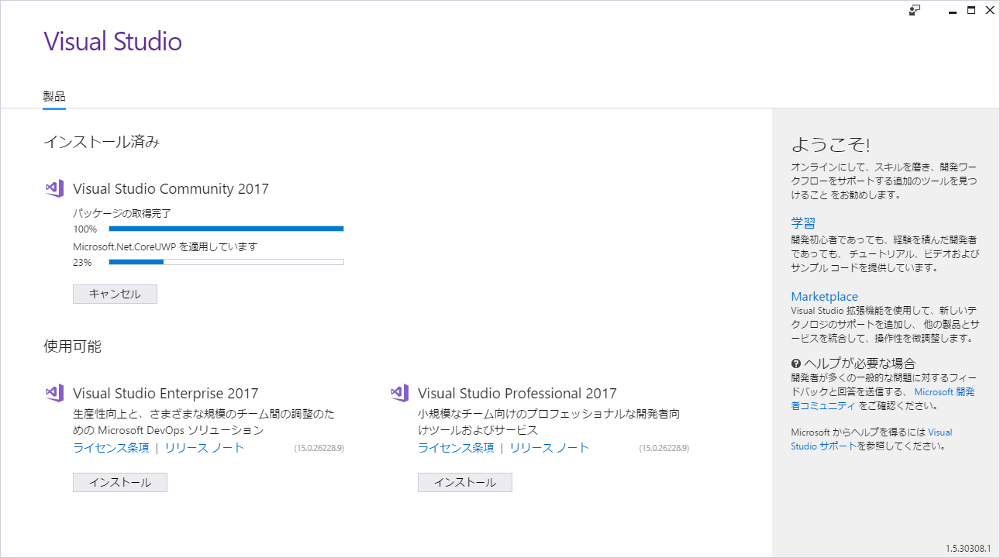
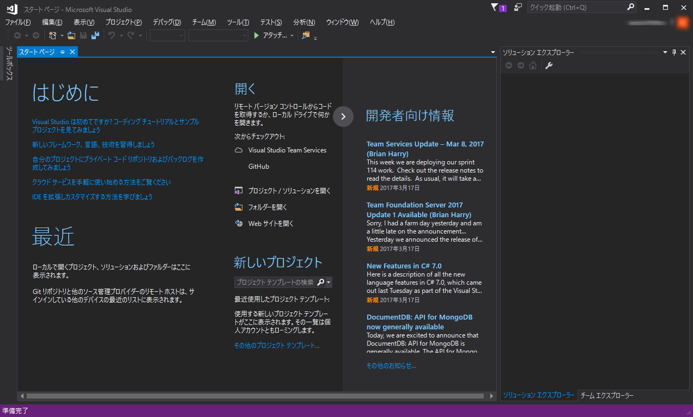

# Visual Studioをはじめよう
- 書いた人: Kenichi Ito(nichiden_27)
- 更新日時: 2017/05/29
- 実行に必要な知識・技能: 特になし
- 難易度: 1/常識の範囲
- 情報の必須度: 3/必要な場合がある

## 概要
Visual Studio(以下VS)は、Microsoft製の統合開発環境(IDE)です。
様々な開発案件に対応でき、特にWindows向けのGUI開発を行いたい場合非常に有効です。

日電においては、日周緯度変のPC制御ソフトや旧星座絵制御ソフトがWindowsのデスクトップアプリケーションです。
今後もWindows向けに開発を行うなら、ぜひVSをインストールしておきましょう。

## 価格
**無料。**

2014年以前にもVisual Studio Expressという無償版が存在したが、有料版より機能が制限されていた。
尤も、学生であればDreamSpark(現: Microsoft Imagine)というプログラムで有料のProfessional版が無償で入手できたという
([【学生は無償】 最新のVisual Studio 2013 を早くも DreamSpark で提供開始！](https://blogs.msdn.microsoft.com/microsoft_japan_academic/2013/10/30/visual-studio-2013-dreamspark/))。

2014年11月、**Visual Studio Community**が旧Express版を置き換える形で発表された。
個人や小規模開発者という条件付きだが、Professional相当の機能を無償で利用できるようになった。
学生団体での開発ならば、VS Communityがあれば十分であり、VSが実質的に無料で使えると言っていいだろう。

## インストール
※**Windows版を想定**

[VS Communityのページ](https://www.visualstudio.com/ja/vs/community/)にアクセスし、インストーラを入手して起動する。

最新のVS Community 2017は、**モジュール式インストーラ**を採用しており、インストール前に導入する機能を選択するようになっている。
自分に必要な機能だけの構成にすることで、肥大化して時間がかかっていたVSの初回インストールが短時間で可能になったのだ。

「**ワークロード**」タブで、開発を行いたい言語や環境を選択する。
例えばWindowsのデスクトップアプリなら、最低限「.NETデスクトップ開発」を選んでおけば事足りるだろう。

「**個別のコンポーネント**」タブではさらに細かく、インストールする機能を個別に選べる。
興味を引くものがあればチェックを入れておこう。
インストール後からでも構成を変更できるので、ここで深く悩む必要はない。

右下に表示される「インストール サイズ」を確認し、空き容量と通信回線に問題がなければ`インストール`をクリックして実行しよう。

インストールが終了すると、Microsoftアカウントへのサインインを促される。
サインインしなければ30日後に使えなくなるので、もしアカウントを持っていないなら作ってしまおう。

サインインすると、ようやくVSが起動し、以下のような画面が表示される(筆者はテーマ色を変更しているため、標準の画面色と異なる場合あり)。

