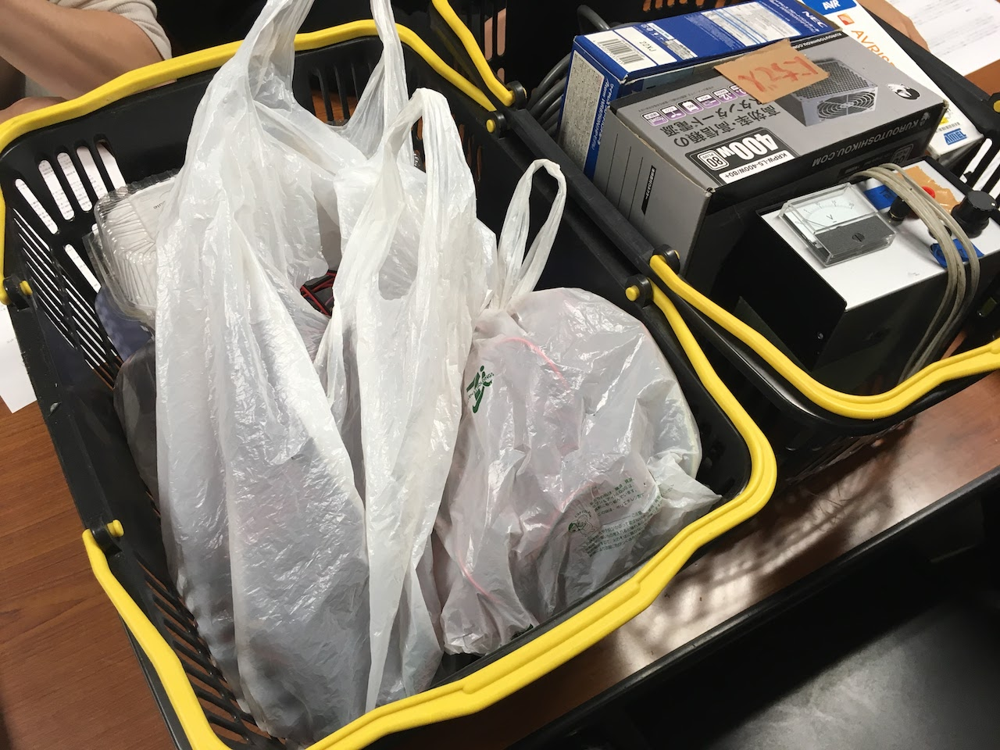
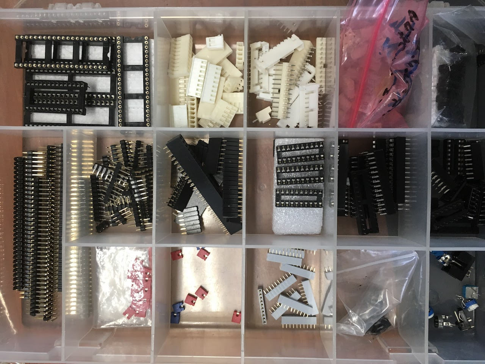

# 備品管理
- 書いた人: Kenichi Ito(nichiden_27)
- 更新日時: 2017/03/25
- 実行に必要な知識・技能: 特になし
- タスクの重さ: 1/数時間で可能
- タスクの必須度: 2/たまにやるべき

## 概要
日電は、日電自体の備品の他に電子部品や工具なども管理することになっています。
各投影機が備品を有効活用できるよう、日頃から備品の状態に気を配りましょう。

## 日電カゴ

部室の机がある側の区画に入って左側の棚に、黒色で持ち手が黄色のカゴが二つある。
この二つが日電のカゴとなっている。

内容は代によって変化するものの、日周緯度変や無線送受信機、主投影機の配線など重要物品が入っている。
このカゴは基本的に他投影機の人は触らないので、**壊れたり無くなったりすると困るもの**を入れておこう。

## 部室の部品及び工具
日電のカゴがあるのと同じ区画の棚には、電子部品や工具などが収納されている。
これらは基本的に日電の管轄で、勝手に使わないようになどと引き継ぎに書いてある投影機もある。

ただし、部室にある部品は基本的に過去に購入して余らせているものなので、各投影機で再利用してもらう方がむしろ有益である。
そのため、27代で部品の一斉調査を行い、機長向けに公開した。
また、部品・工具の使用に関しては以下のガイドラインに従えば自由に可能とした。

> - 使用にあたって特に許可を得る必要はありません(何かあれば日電へ)。
> - 学生会館の外には持ち出さず、使い終わったらすぐに部室に返してください。
> - 箱やカゴごと持ち出されると他の投影機が困りますので、工具や部品はなるべく 必要な数だけ持ち出すようにお願いします。
> - 部品については当該棚の一段目~三段目は余った在庫なので使用できますが、  それ以外の他投影機の箱やカゴのものは勝手に使わないでください。
> - 多くの投影機が電気関係の作業をするため、工具等が足りなくなることがあります。主投・補助投とも必ずないと困る工具は各自持ち込んでください。

部品の在庫調査は毎年行う必要は全くないが、各ケースの内容を軽く見ておくと突然部品が必要になっても対処できるようになるだろう。
箱の大部分にはラベルが付してあり、種類別にある程度分類されている。

27日電がパーツケースの中身を調査した際の資料を以下に示す。
()内以外の部分はケースのラベルと対応している。

1. ヒューズ
2. トランジスタ・IC・マイコン(トライアック)
3. ピンヘッダ・ソケット・コネクタ
4. 力強い抵抗たちなど(大電力抵抗)
5. ミノ虫クリップ(ジャンパ線)
6. DCジャック・プラグ(トライアック)
7. スイッチ(トグル・プッシュ・タクト・マイクロ・ロータリー)
8. コンデンサ(集合抵抗・インダクタ)
9. あわれなレジスタンスたち(袋入り抵抗)
10. LED
11. 線材
12. 線材2
13. 調光器(トライアック万能調光器キット)
14. リレー
15. 放射板(ヒートシンク)
16. 電池ボックス
17. ボリウム(ツマミ)
18. ACソケット・その他コネクタ(大きめのもの中心)
19. ケース・基板・ブレッドボード
20. その他電球・モータなど
21. コネクタ1, 2
22. ネジ1, 2, 3

工具に関しては十分な量が用意してあるが、特にハンダ付け関連のものは消耗しやすいので注意しておこう。
コテ台が足りなかったり、コテ先やスポンジが劣化したりしていた場合は買い出しの際に補充すると良い。
