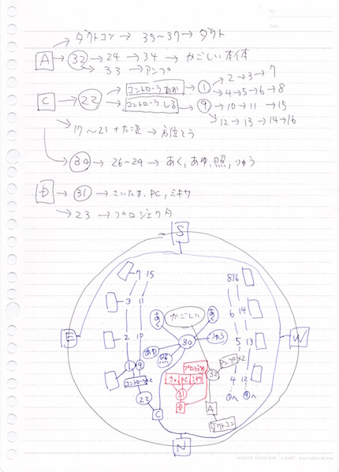
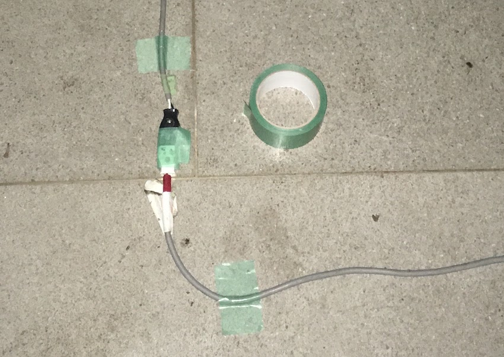

# 配線
- 書いた人: Kenichi Ito(nichiden_27)
- 更新日時: 2017/03/10
- 実行に必要な知識・技能: 特になし
- タスクの重さ: 2/数日かかる
- タスクの必須度: 5/しないとプラネ終了

## 概要
配線には、特別な知識や技能は不要です。
ただし、プラネの大部分には電源が欠かせません。
配線のミスはプラネ全体に響きます。特に入念に準備をするようにしてください。

## 配線を行うタイミング
配線を実際に行うのは、

- 卒検
- リハーサル
- 本番前日準備

の三回。
卒検・リハと本番では、ドームの展開場所が屋外か屋内かという大きな違いがある。

卒検段階では投影機は一部しか運用されないので、全てを配線する必要はない。
ただし、リハ以降の練習ができる唯一の機会でもあり、大した負担でもないので全て配線してしまってもいいだろう。

リハでは、補助投の設置状態などがほぼ確定している。
補助投の仕様変更などを把握し、本番同様の状態を構築できるのが望ましい。

前日準備はとにかく時間との戦いになる。
配線の遅れが投影機調整の遅れ、公演開始の遅れと連鎖してしまうこともある。
コードをつなぐだけなので、手の空いた補助投の人に協力してもらっても構わない。

## 配線計画
### 電力計算
体育館には、使用できる電力に制限がある。
ブレーカーが落ちないよう、館内で個人的な充電等をしないよう注意されたのを覚えているかもしれない。
実際には滅多に起きないことだが、もし起こしてしまえば即企画停止である。
各投影機が使用する電力を把握し、負担を分散させることは大変重要だ。

各投影機の消費電力は、白熱球やハロゲンランプからLEDへの移行によって減少傾向にある。
ただ、あおとうやソフトなど大電力を要求する投影機があるため、急激に上下することはない。
毎年3000W前後であり、大学側への申請は更に余裕をみて**3500W**としてある。

参考までに、27で計算した電力を掲載する。数値は概略である。
投影機仕様に大幅な変更があれば、必要に応じて再計算して欲しい。

| 投影機     	| 種別           	| 使用数 	| 電力[W] 	| 電圧[V] 	|
|------------	|----------------	|--------	|---------	|---------	|
| こうとう   	| パワーLED3W    	| 32     	| 100     	| 12      	|
| いっとう   	| LED            	| 20     	| 2       	| 5       	|
| 星座絵     	| パワーLED1W    	| 28     	| 30      	| 12      	|
| ぎんとう   	| パワーLED1W    	| 4      	| 4       	| 12      	|
| ドーム     	| ダクト用ファン 	| 3      	| 200     	| 交流100 	|
| ソフト     	| スピーカーなど 	| ~      	| 1000    	| 交流100 	|
| 日周緯度変 	| モータ         	| 2      	| 100     	| 24      	|
| あおとう   	| 白熱球         	| 8      	| 1000    	| 交流100 	|
| あくとう   	| パワーLED1W    	| 30     	| 40      	| 12      	|
| あゆとう   	| 白熱球         	| 1      	| 100     	| 交流100 	|
| しるとう   	| パワーLED1W    	| 8      	| 24      	| 12      	|
| りゅうとう 	| ?              	| ?      	| 100     	| ?       	|
| **合計**   	| ~              	| ~      	| **2700**	| ~       	|

### 電力配分
第二体育館の電源系統は一つではなく、4つに分かれている。
一つの系統に負担が集中しすぎると、落ちてしまうというわけだ。

この画像は、23代の頃作成されたもので出典不明だが、日電の配電計画はここに書かれた数字を元に決定されてきた。
しかし、配線の根元となる **コードリールの定格が1500W**であり、1500Wを目安とするのが安全だろう。

二体の南と東向きの壁面がA系統、西側がB系統、女子更衣室前とトイレ前がそれぞれC系統とD系統となっている。

現在の配分では、用途別に四系統に振り分けている。

- A系統: ダクト・かごしい(主投)・スピーカーアンプ
- B系統: その他(ドーム外の作業や充電用)
- C系統: 補助投
- D系統: 日周緯度変・PC・ミキサ

ソフト関連は、PCのノイズが影響しないようアンプとそれ以外を分ける慣例となっている。
また、主投と補助投は別電源にするなどリスクを抑える工夫がある。

### 配線図
電力配分が決まったら、配線図を作成する。
配線図は毎年作成されているものではなく、実際数年で大きくは変わらないので流用してもいい。
ただし、配線の様子を頭に入れるには、実際に図を書いてみるのが有効だろう。

27で更新した配線図を掲載しておく。
配線図はドーム内で作業中に繰り返し参照することになるので、各自の端末にすぐ表示できるようにしておくと良い。

## コードの管理
### 在庫調査
卒検やリハの前に、人数が集まる機会を狙ってコードの在庫調査をしておきたい。
込み入った作業ではないので、数時間かければ終わる。

部室の機材などがある側に、延長コードが入った大きなケースがある。
大量の金属が入っているのでかなり重いので運ぶときは注意。
27まではダンボールに入っていたが、中身の重さで破れてしまうのでプラスチックのケースに変更した。

山ほどコードがあるように見えるが、プラネがフル稼働するとギリギリの数しかないので必ず全てあるか確認すること。プラネ作業中は他の投影機が持ち出していたりすることも多々ある。

コードには、番号を書いたテープが付いている(番号がないものは予備である)。
適切な長さや口数のものが使えるよう、通し番号で管理されているのだ。27で長さや口数の調査をしたので、結果を掲載する。

| 通し番号 	| 用途                            	|                                           	|
|----------	|---------------------------------	|-------------------------------------------	|
| 1-8      	| C(to22)あおとう配線             	| 1：3m (分岐用) ２-6：5m 7,8：5m(端っこ)   	|
| 9-16     	| C(to22)しるとう配線             	| 9：3m(分岐用) 10-14：5m 15,16：5m(端っこ) 	|
| 17-21    	| C方位とう配線                   	| 17:3m(3) 18,19:10m(1) 20:5m(1) 21:5m(3)   	|
| 22       	| Cあお、しる、方位コントローラ用 	| 3m 4口                                    	|
| 23       	| Dプロジェクター用               	| 5m 1口                                    	|
| 24       	| A(to32)かごしい用               	| 2m 1口                                    	|
| 26-30    	| C補助用                         	| 30:タップ 26-28:2m(3) 29:2m(1)            	|
| 31       	| Dさいたま、PC                   	| タップ                                    	|
| 32       	| A分岐アンプかごしい             	| 4m(1)                                     	|
| 33       	| A(to32)アンプ                   	| 2m(3)                                     	|
| 34       	| A(to24)かごしい本体             	| 3m(4)                                     	|
| 35-37    	| A ダクト                        	| 35:4m(1) 36:14m(1) 37:15m(1)              	|
| 外1-4    	| 外                              	| 20m,20m,15m,15m                           	|

毎年長さを測る必要はなく、直近で調査がなされているなら全部の番号があるかだけ調べれば良さそうだ。

これとは別に、コンセントが四口あるコードリールが部室に5つある。

### コードの買い増し
延長コードは既製品で、簡単に切れたりはしないので買い替えのスパンは長い。
また、現状の量で本番に対応できているのでこれ以上増やす必要性はあまりない。
古かったり汚れが気になるものを適宜買い換える程度で大丈夫だろう。

パソコン用の電源タップは壊れると替えが効かず、またスイッチが光るタイプはドームを暗くした時に邪魔なので、光らないものを買ってもいいかもしれない。

## ドーム外配線
### 卒検・リハ
卒検やリハ時のドーム外配線は、本番にはない屋外作業となる。各投影機が予定通り調整できるよう、確実に配線しておきたい。

#### タイムスケジュール
ドームを膨らませる前に**ダクトの配線**だけは完成していなければならないので、機長会議で予定時刻を確認して計画を立てよう。
早朝から開始となるので、前日の夜間に最低限二人は参加しておくのが望ましい。
なお、日電は基本的に配線優先のため**ドーム作業が全て免除される。**

#### トレ体
当日、電源は**トレーニング体育館(トレ体)と第一体育館(一体)**から取っていいことになっている。
トレ体が5:00に開くので、まずはトレ体からドームの場所までコードを引っ張ろう。
入り口から入り、左の廊下に曲がってすぐの場所にコンセントがある。

ここで注意だが、人が通る場所では **引っかからないようコードを固定しなければならない。**
養生テープを用意し、一定間隔に貼っておこう。これは卒検やリハに限らず、本番でも必要なことだ(しかし、地面が濡れていて固定が難しいこともあるので臨機応変に)。

#### 一体
ドームが膨らみ終わる頃には一体が開いているので、一体からもコードを引いてこよう。
一体のコンセントは差込みがゆるく抜けてしまうことがあったので、テープで念入りに固定しておくと良い。

#### 危険箇所
配線が切れてしまいがちな場所と、対策を列挙する。

- コンセント: テープで固定する
- ドア(開閉で引っ張られる): ドアの下をくぐらせるか、コードをたるませる
- コード同士の接合部: テープを巻いて補強

### 本番
屋内でコードを引っ張るだけなので、卒検やリハよりは楽なはずだ。
かなり床が冷える中二体中を歩き回るので、スリッパの用意があると幸せになれる。

二体のコンセントも、グラグラしているものや壊れているものがある。コンセント周辺は抜けないように念入りに固定し、できれば注意書きもあるとなおよい。

コードの固定は、広大な二体のあらゆる場所で行うのは無理があるためできる範囲で。ただし、C系統(女子更衣室前)から**入り口を横切る部分**はお客様が大勢通るので、コードが浮かないようにしておこう。

## ドーム内配線
ドーム内配線は、本番までやることがそう変わらない。
星潰しが終わる頃にコードを搬入し、配線図を見ながらコードを繋げていこう。

ソフトには、どのコンセントを使っていいか伝えておけば音響の配線を進めてくれる。
ドーム外周のあお・しる・方位については、日電で配線してしまっても補助投に任せてもいい。
任せる場合は**どれがどの投影機の配線かわかるよう、置き方などを工夫**しよう。

ドーム内は末端の投影機の線が抜けても繋ぎ直せばいいだけだが、**コードリールの根元**などは余裕があるときに固定をしておく方が良い。
**ドームのダクトコンソール**も、線が抜けるとドームがしぼんで慌てることになるので、テープを巻いておくべきだ。

本番では、ドーム内にお客様が大勢入られるので、対策が必要だ。
ケーブル類はできるだけスタッフ席側を通るべきだが、その上で銀マットなどを敷いて隠すようにする。
