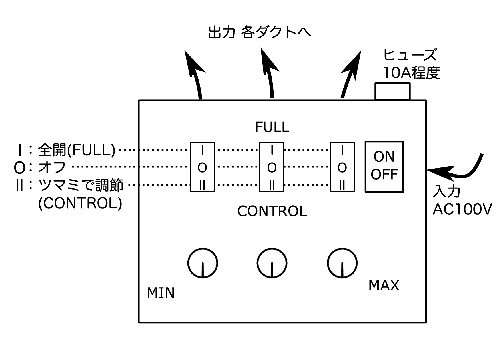

主投影機との連携
================

-  書いた人: Kenichi Ito(nichiden\_27)
-  更新日時: 2017/03/25
-  実行に必要な知識・技能:
-  タスクの重さ: 2/数日かかる
-  タスクの必須度: 3/年による

概要
----

駒場祭プラネでは、ほぼ全ての主投が電気に関わる作業をすることになります。
残念ながら、電子回路の知識が不十分なまま主投の作業を進めてしまう例も過去にありました。
主投の回路にミスがあると卒検やリハで上手く動かないのはもちろん、最悪の場合\ **日電側の重要機器が壊れる**
こともあり得ます。

忙しくなってから無用な手間をかけずに済むよう、早めに各主投の機長と情報交換を行いましょう。

こうとう
--------

こうとうのモジュールは年々改良が進んでおり、引き継ぎも十分に行われている。
とりわけ26代で再設計されたユニットは、LEDの放熱も考慮されており、耐久性にも優れている。
3WのパワーLEDを光らせるだけの回路なので、特に頼まれない限り日電が補助する必要はないだろう。

ただし、32個のユニットを全点灯すると、南北合わせて100W近く消費することになる。
こうとうへの電力を供給する回路やケーブルは、\ **大電流に耐えられる**
ものにするよう注意されたい。

*主な使用部品*

-  `放熱基板付3W白色パワーLED <http://akizukidenshi.com/catalog/g/gI-08956/>`__
-  `定電流方式ハイパワーLEDドライバモジュール(3W1個点灯) <http://akizukidenshi.com/catalog/g/gM-04487/>`__

いっとう
--------

いっとうは星の色を再現するため多様な色のLEDを用いる。
引き継ぎ資料が充実しており、LEDの抵抗計算も解説されている。

使用しているLEDの型番などは確認していないが、\ `LEDパラダイス <http://www.led-paradise.com/>`__\ などで直系の大きいLEDを入手しているそうだ。
パワーLEDではないため、電力についてはそれほど気にしなくていいはず。気になるならいっとう側に確認してほしい。

またたき回路の開発は基本的に日電に一任されている。
頃合いを見て、またたき具合や種類の希望がないか機長に聞き取りをしておこう。

ぎんとう
--------

消滅と復活を繰り返していたが、最近はクオリティが上がっている投影機。
光源は1Wの白色パワーLED。

27代で\ **調光機能** が新設された。
投影された天の川が明るすぎ、恒星をかき消してしまう事態を避けるためである。
位置調整の時は明るくするなどの応用もできる。

調光には、あくとう・しるとうと同様「定電流方式ハイパワーLEDドライバモジュール」に載っている\ ``CL6807``\ の機能を用いる。
27日電では、PWMを使うべきと思い込んでいたため\ `手軽にPWM信号を作れるキット <http://akizukidenshi.com/catalog/g/gK-06244/>`__\ を使用した。
ドライバモジュール側とキットでGNDを合わせる必要があることから、多少改造して使っている。

ただしその後、\ ``CL6807``\ の調光は電位の変化によっても可能であることが分かった(\ `補助投の記事参照 <hojotou.html>`__)。
抵抗二つと可変抵抗一つで調光できてしまうので、PWMに比べて部品点数やサイズが大幅に減る。

今後のぎんとうでは、電位による調光を使っていくべきだろう。
先方と調整の上、部品買い出しなどのサポートを行って欲しい。

*主な使用部品*

-  `放熱基板付1W白色パワーLED <http://akizukidenshi.com/catalog/g/gI-03709/>`__
-  `定電流方式ハイパワーLEDドライバモジュール(1W3個点灯) <http://akizukidenshi.com/catalog/g/gM-04488/>`__
-  `PWM(スイッチング方式)DCモーター速度可変キット <http://akizukidenshi.com/catalog/g/gK-06244/>`__:
   **今後の使用は非推奨**

星座絵
------

星座絵は、1W白色パワーLEDを使用している。
過去にLEDを抵抗なしで回路に繋ぐ、極性を間違えるなどの事象があり、\ **無線受信機の故障原因を作った可能性もある。**

代によって知識に差があるのは当然なので、日電側からも基本的な知識については確認しておこう。

*主な使用部品*

-  `放熱基板付1W白色パワーLED <http://akizukidenshi.com/catalog/g/gI-03709/>`__
-  `定電流方式ハイパワーLEDドライバモジュール(1W3個点灯) <http://akizukidenshi.com/catalog/g/gM-04488/>`__

ドーム
------

ドームを膨らませる際に使う\ **ドームコンソール**\ (ダクトコントローラー)のメンテナンスは日電管轄である。
ドームを直立させるため、3つのダクトそれぞれの風量を調節できるようになっている。

.. figure:: _media/ductcontroller.jpg
   :alt: ドームコンソールの外観

   ドームコンソールの外観

中には秋月電子の\ `トライアック万能調光器キット <http://akizukidenshi.com/catalog/g/gK-00098/>`__\ が3つ入っている。
交流の波形を変えることで出力パワーを変更するキットである。

破損の可能性があるのは基本的にトライアックなので、万一故障してもトライアックを替えれば復活するかもしれない。
大電流から回路を保護するためヒューズがついているので、切れた場合は部室の予備と交換しよう。

上側のスイッチでFULL/OFF/CONTROLの切り替え、下側のツマミで風量調節をする。
内部を見ればわかるが、FULLは入力・出力を直接繋ぐので、キットが使えなくなったとしても送風を継続できる。

   ドームコンソールの使い方

2016年現在、24のドームコンソールが現役である。 以下は当時使用した部品。

-  タカチ MB-6 W140 H75 D200 ¥1,092
-  マル信無線 MSR-6#7 中点OFFロッカスイッチ ¥158
-  ロッカスイッチ 秋月AJ8221B ¥100
-  ベターキャップ WH4015PK ¥115 マルツ
-  ベターコネクタ
-  トライアック調光器40A ¥800
-  ユニバーサル基板 48 mm \* 72 mm
-  ヒューズホルダ（パネル取り付け・ミゼット用） ¥84

ソフト
------

早いうちに連絡を取っておくべきである。
代ごとのソフトの方針によって、日周緯度変や無線制御などに手を加えるべきか否かが左右されるためだ。

かごしい
--------

主投を組み立てる際には日電と一体になって動くことが多い。
かごしいは機構部分、日電は回路部分との暗黙の住み分けがある。

かごしい内のAC100Vケーブルの配線はかごしいに引き継がれているが、実際は日電が行うこともあるので資料を見せてもらうと良いだろう。
かごしい内配線については別記事で詳しく扱う。

展示
----

展示は、電気を使った模型を製作したこともあるが、基本的には電気と関わりのない唯一の主投と言っていい。
27代では、無線制御システムの解説ポスターを作成し、印刷と展示を依頼した。
